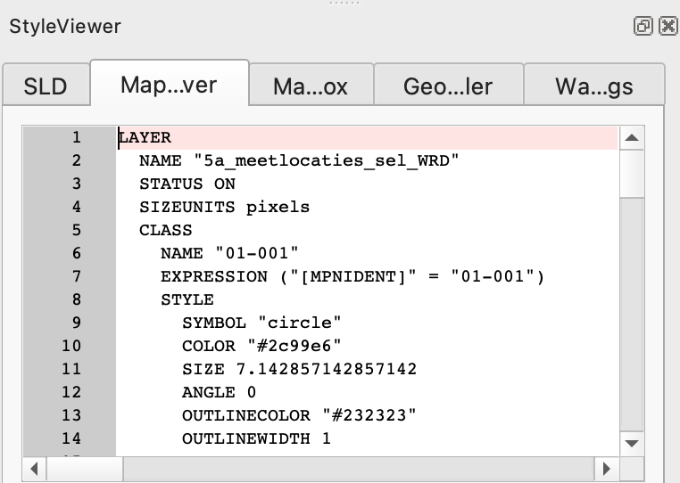

# MapServer

*Status: ready*

MapServer, originally `UMN MapServer`, is an open source server component which provides OWS services on a variety of data sources.
MapServer is commonly used to set up INSPIRE View Services. A detailed guidance on how to use MapServer to set up INSPIRE View Services is available at https://mapserver.org/ogc/inspire.html.

MapServer supports WFS and WCS as data exchange mechanisms. MapServer is not able to publish datasets having a hierarchical structure, as common in many INSPIRE datasets, which makes MapServer less suitable to provide INSPIRE download Services using WFS. Stored queries are supported. MapServer can be used to set up a WCS Download service.

MapServer runs as a [CGI](https://en.wikipedia.org/wiki/Common_Gateway_Interface) executable. The progream will start up as soon as a request arrives at the server. This makes mapserver very suitable for situations where many datasets are incidentally queried and scales out very well.

MapServer is configured using [map files](https://www.mapserver.org/mapfile/). These mapfiles contain metadata for each layer, connection details to the datasource and styling rules for the vizualisation. Various tools exist which create mapfiles automatically, from for example a [QGIS layer with GeoCat Bridge](bridge-geoserver-geonetwork.md). Or by using python script, for example with the [mappyfile](https://github.com/geographika/mappyfile) library.
The View services relevant for INSPIRE Soil are described in [INSPIRE Data Specification on Soil – Technical Guidelines](https://inspire.ec.europa.eu/id/document/tg/so) in [chapter 11](https://github.com/INSPIRE-MIF/technical-guidelines/blob/2022.2/data/so/dataspecification_so.adoc#layers-to-be-provided-by-inspire-view-services). 3 types of layers can be distinguished:
- Soil body, Soil profile and Soil Site are vector datasets indicating the location of research area's.
- Soil properties as vector provide a map view of soil observations on soil profiles or the distribution of a soil property in soil bodies, derived from observations in the area and/or expert judgement.
- Soil properties as coverage, coverage (grid) is a common output of statistical models which calculate the distribution of a soil property.

## The MapServer Mapfile

For this recipe we'll prepare a WMS view service on a Soil Body dataset. For each Soil Body some derived soil properties of the top soil are available.

MapServer is configured using [map files](https://www.mapserver.org/mapfile/). These mapfiles contain metadata for each layer, connection details to the datasource and styling rules for the vizualisation. In a typical configuration a user 'calls' the mapserver executable via the web, while indicating the relevant mapfile. For example:

```
https://example.org/mapserv.cgi?map=/data/soilbody.map&service=WMS&request=GetCapabilities
```

Various tools exist which create mapfiles automatically, from for example a QGIS layer. See https://plugins.qgis.org/plugins/geocatbridge/.

In this case we'll assemble the mapfile in a text editor. For some of the more advanced text editors, such as [Visual Studio Code](https://code.visualstudio.com/), mapfile editing plugins are available, which provide validation and syntax highlighting.

A generic mapfile Quick Start is provided at https://live.osgeo.org/en/quickstart/mapserver_quickstart.html. The quickstart is based on [OSGeo Live](https://live.osgeo.org/), a virtual DVD, which offers a preinstalled mapserver and has data from [Natural Earth](https://www.naturalearthdata.com/downloads/).

Within the mapfile, created in the Quickstart, let's replace some metadata and update the natural earth layer to point to our soil body dataset.

``` 
MAP
  NAME "SOILBODY_QUICKSTART"
  EXTENT -180 -90 180 90
  UNITS DD
  SHAPEPATH "/home/user/data/"
  SIZE 800 600

  IMAGETYPE PNG24

  PROJECTION
    "init=epsg:4326"
  END

  WEB
    METADATA
      ows_title "Soil Body Quickstart"
      ows_enable_request "*"
      ows_srs "EPSG:4326 EPSG:25832 EPSG:25833"
    END
  END

  LAYER
    NAME "Soilbody"
    STATUS ON
    TYPE POLYGON
    DATA "soilbody"
    CLASS
      STYLE
        COLOR 246 241 223
        OUTLINECOLOR 0 0 0
      END
    END
  END

END
```

## MapServer via Docker

MapServer requires a number of dependencies, which may be hard to install on some systems, that's why this recipe suggests to work with Docker containers which are prepared to run mapserver.

The [camp2camp mapserver image](https://hub.docker.com/r/camptocamp/mapserver) is a commonly used mapserver container image. While starting the container we provide a number of parameters so the container is able to locate the mapfile and the data files.

```
docker run -p=80:80 \
    -v=$(PWD)/soilbody.map:/etc/mapserver/wms.map \
    -v=$(PWD)/data:/home/user/data/ \
    camptocamp/mapserver
```

## Testing a mapfile

Sometimes mapserver reports an error while generating a map response.
If the logs of the container do not provide enough information, mapserver provides an interesting utility [map2img](https://mapserver.org/utilities/map2img.html) to validate a mapfile. To run the utility, you have to open bash on the container: 

```
docker exec -it <container> /bin/bash 
```

and then run the utily:

```
map2img -m local.map -o test2.png
```

- `-m` references the mapfile
- `-o` references an output file to be generated


## WRB layer with GeoCat Bridge 

The technical guidance provides quite detailed instructions on how to style the relavant soil layers. For example a SO.SoilBody.WRB is described with dedicated colors for each WRB Soil type.

| WRB RSG Code | WRB RSG Name | Colour RGB code | Colour HEX code |
| --- | --- | --- | --- |
| AC | Acrisol | (247, 152, 4) | #F79804 |
| AB | Albeluvisol | (254, 194, 194) | #FEC2C2 |
| AL | Alisol | (255, 255, 190) | #FFFFBE |
| .. | .. | .. | .. |

If many style rules are involved (or if your project already has styling) a tool like GeoCat Bridge is helpfull. Read more about GeoCat Bridge in the [recipe Bridge and GeoServer](bridge-geoserver-geonetwork.md). On QGIS, with the GeoCat Bridge plugin installed, load a SoilBody dataset and assign some of the colors. In the web > bridge menu, activate the Style viewer panel. Notice the various tabs in the panel which represent the layer style in various encodings. The first tab contains [Styled Layer Descriptor](https://www.ogc.org/standards/sld) (SLD), a standardised styling format, used for example in GeoServer. The second tab presents the mapfile syntax, you can copy the value into your mapfile (or let Bridge generate a full mapfile).



## MapServer and WMTS

MapServer does not provide tile services (WMTS) itself, but is often combined with a separate tool, [mapcache](https://mapserver.org/mapcache/), which provides tile service on top of a MapServer instance. Tile services are generally a safer option with respect to Quality of Service, but less dynamic in update and styling options. An interesting option is to use the WMS option of Mapcache, which uses a cache of tiles as a source to provide WMS services.

## Read more:

- Website: https://mapserver.org
- GitHub: https://github.com/MapServer/MapServer
- Docker: https://hub.docker.com/r/camptocamp/mapserver
- OSGeo: https://www.osgeo.org/projects/mapserver
